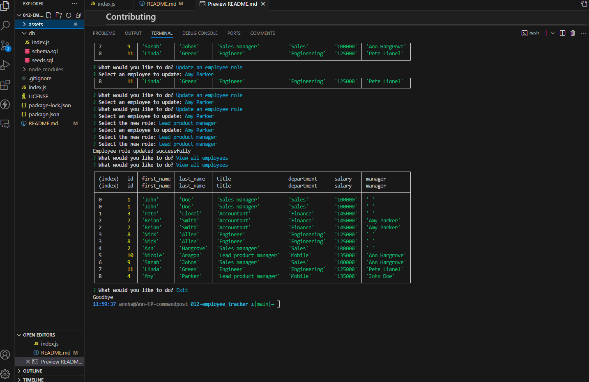

# 012-employee_tracker

## Description
This command-line application manages a company's employee database, using Node.js, Inquirer, and PostgreSQL.

## Table of Contents
- [Installation](#installation)
- [Usage](#usage)
- [License](#license)
- [Contributing](#contributing)
- [Tests](#tests)
- [Questions](#questions)

## Installation
To install, clone the repository and run `npm install`.

## Usage
Run the application using `npm start`.

## License
This project is licensed under the MIT license.

## Contributing
Welcome to Contribute! Fork the repository, create a new branch, and submit a pull request with your changes. Ensure your code adheres to the coding standards and is well-documented.

## Tests
n/a

## Questions
If you have any questions, you can reach me at [annhargrove21@gmail.com](mailto:annhargrove21@gmail.com). You can also find more of my work at [agrove21](https://github.com/agrove21).

## Walkthrough Video
Watch the walkthrough video to see the application in action: [Watch Video](https://app.screencastify.com/v3/watch/nMRvsIc14Ywicsgp6Z2J)

## Screenshots
### View all departments, roles, and employees

### Add a department, role and employee

### Update an employee role

